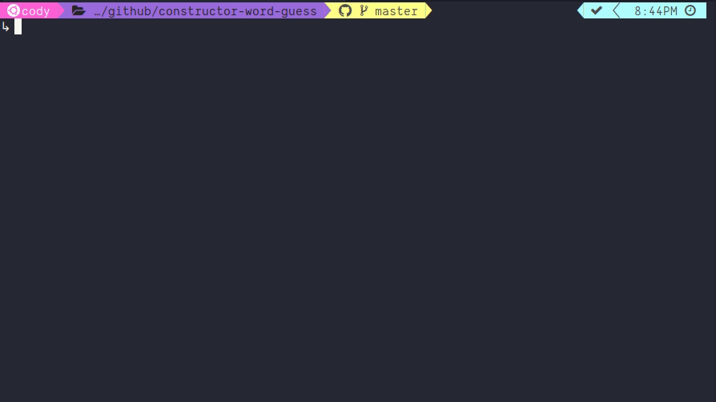

# Hard Mode CLI Word Guess

A CLI word guessing game built with Node.js, with some hard words to guess.

## Demo

## Prerequisites

You must have node installed. To download node, visit https://nodejs.org.

## Usage

Clone this directory using:

`git@github.com:cfbender/constructor-word-guess.git`

Navigate into the right directory:

`cd constructor-word-guess`

Download the required modules using:

`yarn install` or `npm install`

Then start the game:

`node ./src/index.js`

## Rules

- Follow the prompt to guess a letter. Any character that is a-z or A-Z is a valid guess.
- You have 10 guesses, including the last one.
- Once you win or run out of guesses, you can play again using a new word.
- Good luck!
